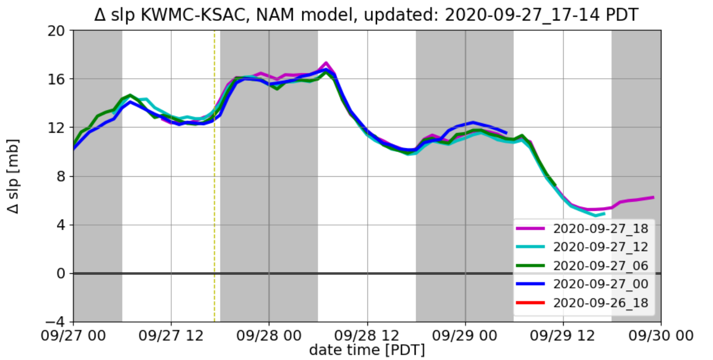
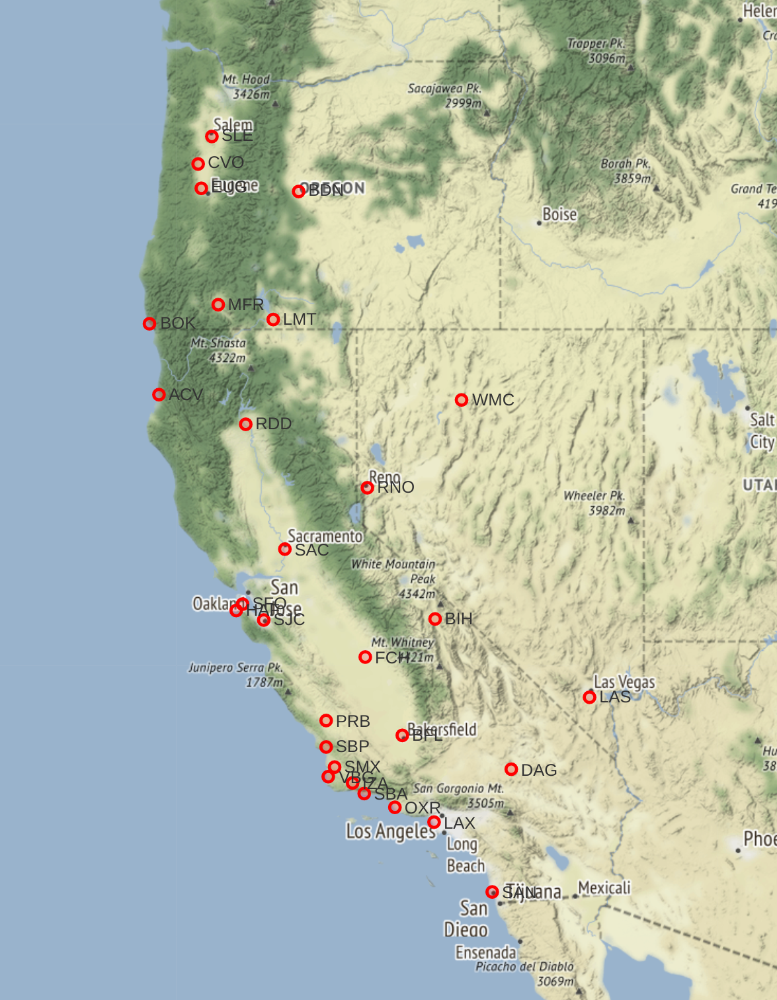

# pgrad.io

Operational pressure differences from key weather stations on the West Coast are often
used a rubrics for the strenght of various wind events such as Sundowners and Diablo winds.
This repo is a fully contained codebase for observing and forecasting this rubric
and contextualizing it with historical events.

## Table of Contents

1. [Website and scientific presentation](README.md#website-and-scientific-presentation)
1. [Dataset](README.md#dataset)
1. [Stations](README.md#stations)
1. [Architecture and Setup](README.md#architecture-and-setup)

## Website and scientific presentation

The website is currently only available inside a VPN.  Public release is 
slated for 11/01/2020.

Website currently consists of the following:
Operational time series of observed and forecast pressure differences from various
surface stations across the Western US.
Tables of maximum observed pressure difference from historical top events for station pairs
Cumuluative Distribution function of observed pressure difference from station pairs.

Taken together, this roughly allows the end-user to determine in operational 
context how an upcoming forecast event will compare relative to events of historical importance
and relative to all observed events.  It will also all the end-user to 
examine how the model solutions are tracking against observed values to check for bias, 
and how various model solutions compare against each other.

*Example figure showing forecast pressure difference Winnemmucca to Sacramento 
across recent NAM initializations*

## Dataset

Observational data consists of surface observations pulled in via MesoWest API.
Model consists of operational runs updated 4x day of the following NWS models:
- GFS - 10 day forecast horizon
- NAM - 60 hr forecast horizon
- HRRR - 36 hr forecast horizon 

All data and figures are refreshed hourly.

## Stations

Pressure differences are calculated from stations pairs shown below.  Feel free to suggest more.

## Architecture and Setup

Project currently runs on a t1 instance on AWS with no additional hard disk.
ETLs are written in bash and python using cron jobs, and the website is served with Apache.
The `src/crontab.txt` contains details of all jobs that are run and 
the `setup/README.md` has additional details.
[Link](https://github.com/weathertrader/pgrad/tree/master/setup)

